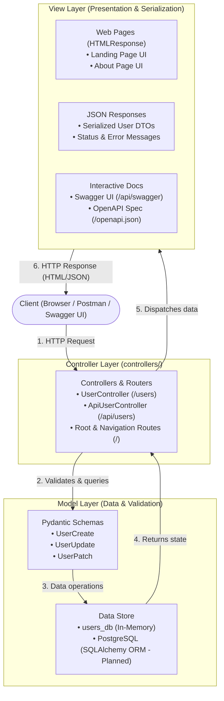

# Alumni Tracking System

This project is an **Alumni Tracking System** developed for the Web Programming course at Istanbul University.

## Technology Stack

* **Backend:** FastAPI (Python)
* **API Documentation:** Swagger UI & OpenAPI (Automated)
* **Database:** PostgreSQL
* **ORM:** SQLAlchemy
* **Containerization:** Docker & Docker Compose

## MVC Architecture

The application adopts the **Model-View-Controller (MVC)** architectural design pattern to ensure separation of concerns, maintainability, and scalability. Each layer has clearly defined responsibilities:



---

### 1. Model (M) — Data Representation, Validation & CRUD Logic

The **Model** layer encapsulates the data structures, validation rules, state management, and CRUD operations:

* **User Model (`models/user.py`):**
  * Implemented without database connection using simulated in-memory storage (`_db`).
  * Features complete CRUD functions:
    * `User.create(data)`: Generates auto-incrementing ID and saves user record.
    * `User.get_all()`: Retrieves all user records.
    * `User.get_by_id(user_id)` & `User.get_by_email(email)`: Finds specific user records.
    * `User.update(user_id, data)`: Performs full update (PUT) on existing records.
    * `User.patch(user_id, data)`: Performs partial update (PATCH) on specified fields.
    * `User.delete(user_id)`: Removes records by ID.
* **Data Validation & Schemas (Pydantic):**
  * `UserCreate`: Validates attributes required to register an alumnus (`first_name`, `last_name`, `email`, `graduation_year`, `department`).
  * `UserUpdate`: Enforces schema requirements for full entity updates via `PUT`.
  * `UserPatch`: Provides optional fields for granular, partial updates via `PATCH`.
* **Data Storage & State:**
  * In-memory store (`User._db`) maintains runtime state without requiring external database services.
  * Architecturally prepared for seamless migration to **PostgreSQL** via **SQLAlchemy ORM** models.

### 2. View (V) — Presentation & Serialization

The **View** layer is responsible for formatting and presenting data to clients and users:

* **HTML Views:**
  * `LANDING_PAGE_HTML`: Responsive landing page view served at `GET /` with navigation and system highlights.
  * `ABOUT_PAGE_HTML`: Information page view served at `GET /about` describing the project scope.
* **REST API JSON Views:**
  * Standardized JSON structures serialized from Python dictionaries and Pydantic schemas, returning entity data, status codes, and operational messages.
* **Interactive Documentation Views:**
  * **Swagger UI** (`/api/swagger`, `/docs`) and the **OpenAPI Schema** (`/openapi.json`), offering live interactive interfaces for inspecting and executing endpoints.

### 3. Controller (C) — Request Handling & Application Logic

The **Controller** layer intercepts incoming HTTP requests, coordinates validation, executes business logic via the Model, and delegates to the appropriate view:

* **UserController (`controllers/user_controller.py`):**
  * `/users` yoluna bağlı kullanıcı kontrolcüsüdür.
  * Sunum için **View katmanını (`views/user_view.py`)** kullanır. Kendisi veri tutmaz, Model katmanını (`User`) çağırır.
  * Web sayfası (`/users`) üzerinden **Tüm CRUD Operasyonlarının** interaktif olarak yönetilmesini sağlar:
    * `GET  /users` $\rightarrow$ **Listing / Read All (R):** Modelden kullanıcıları çeker ve `UserView` üzerinden listeler. Arama/filtreleme çubuğu içerir.
    * `GET  /users/{id}` $\rightarrow$ **Read One (R):** Belirtilen ID'deki mezun detayını görüntüler.
    * `POST /users` $\rightarrow$ **Creating (C):** Sayfadaki HTML formu üzerinden yeni mezun kaydı ekler (HTTP 201).
    * `POST /users/{id}/update` & `PUT /users/{id}` $\rightarrow$ **Updating (U):** Web sayfasındaki interaktif düzenleme modalı (Edit Modal) üzerinden mezun bilgilerini günceller.
    * `POST /users/{id}/delete` & `DELETE /users/{id}` $\rightarrow$ **Deleting (D):** Web sayfasındaki silme butonuyla mezun kaydını siler ve listeyi tazeler.
  * Swagger UI üzerinde **"User"** grubu altında listelenir.

* **ApiUserController (`controllers/api_user_controller.py`):**
  * `/api/users` yoluna bağlı bağımsız REST API kontrolcüsüdür (`UserController`'dan miras almaz).
  * Aynı CRUD işlemlerini kendi içinde ayrı ayrı tanımlar ve aynı model katmanını (`User`) çağırarak JSON yanıtlar döner.
  * Swagger UI üzerinde **"ApiUser"** grubu altında listelenir.

* **View Katmanı (`views/`):**
  * `views/user_view.py`: `UserView` sınıfı, şablon verisini bağlayıp `HTMLResponse` üretir.
  * `views/templates/users.html`: Modern Jinja2 HTML şablonu (Mezun listesi + Yeni mezun ekleme formu).

* **Paylaşılan Bellek İçi Veri Kaynağı (Shared In-Memory Storage):**
  * Her iki controller da (`/users` ve `/api/users`) aynı bellekteki veri kaynağını (`User._db`) paylaştığı için birinden eklenen kayıt diğerinden de doğrudan görünür ve güncellenebilir.

---

### MVC Component Mapping Table

| MVC Component | Application Artifact | File / Location | Description |
| :--- | :--- | :--- | :--- |
| **Model** | `User` Model (CRUD: `create`, `get_all`, `get_by_id`, `update`, `patch`, `delete`) | `models/user.py` | Bellek içi kullanıcı veri modeli ve CRUD veri yönetimi |
| **Model** | `UserCreate`, `UserUpdate`, `UserPatch` | `models/user.py` | Pydantic veri şemaları ve girdi doğrulama |
| **Model** | `User._db` (In-Memory Store) | `models/user.py` | Ortak bellek içi veri saklama listesi |
| **View** | `UserView` & `users.html` (Jinja2) | `views/` | `/users` için interaktif web CRUD arayüzü (Arama, Liste, Ekleme, Düzenleme, Silme) |
| **View** | `LANDING_PAGE_HTML`, `ABOUT_PAGE_HTML` | `main.py` | İstemci karşılama HTML sayfaları |
| **View** | JSON Responses & HTTP Statuses | `controllers/api_user_controller.py` | REST API için serileştirilmiş JSON veri yanıtları |
| **View** | Swagger UI & OpenAPI Specification | `/api/swagger`, `/openapi.json` | İnteraktif API dokümantasyon arayüzü |
| **Controller** | `UserController` (`/users`) | `controllers/user_controller.py` | Web arayüzü ve View katmanı ile tam CRUD operasyonları (C, R, U, D) |
| **Controller** | `ApiUserController` (`/api/users`) | `controllers/api_user_controller.py` | Bağımsız REST API CRUD kontrolcüsü (Swagger: "ApiUser") |
| **Controller** | Root Route Handlers (`/`, `/about`, `/health`) | `main.py` | Sistem seviyesi navigasyon ve sağlık kontrolü rotaları |

---

### Project Modular Directory Structure

```text
Alumni/
├── controllers/             # Controller: Request handling & CRUD orchestration
│   ├── __init__.py
│   ├── user_controller.py   # UserController & /users router (Tag: User - Full CRUD with View)
│   └── api_user_controller.py # ApiUserController & /api/users router (Tag: ApiUser - REST API)
├── views/                   # View: UI Templates & View Classes
│   ├── __init__.py
│   ├── user_view.py         # UserView class (HTMLResponse generator)
│   └── templates/
│       └── users.html       # Jinja2 HTML template (CRUD Web Interface)
├── models/                  # Model: Pydantic schemas & In-Memory Data Model
│   ├── __init__.py
│   └── user.py              # User model with in-memory storage (_db) & CRUD
├── Dockerfile
├── docker-compose.yml
├── requirements.txt
├── main.py                  # Application entrypoint & controller registration
└── README.md
```

## Interactive API Documentation (Swagger UI)

FastAPI automatically generates interactive Swagger UI documentation and OpenAPI specifications from the defined routes, controllers, and Pydantic schemas:

* **Swagger UI:** [http://localhost:8000/api/swagger](http://localhost:8000/api/swagger) (also redirects from `/docs`)
* **OpenAPI JSON:** [http://localhost:8000/openapi.json](http://localhost:8000/openapi.json)

Swagger dokümantasyonunda rotalar iki ayrı grup altında gösterilmektedir:
* **"User"** grubu: `UserController` tarafından View katmanı ile sunulan `/users` rotaları.
* **"ApiUser"** grubu: `ApiUserController` tarafından yönetilen `/api/users` REST rotaları.

| Tag | Method | Endpoint | Controller | Description |
| :--- | :--- | :--- | :--- | :--- |
| `system` | `GET` | `/api/health` | Root Controller | Service health check |
| `User` | `GET` | `/users` | `UserController` | **Read All (R):** Web arayüzü ile tüm mezunları listele & ara (HTML) |
| `User` | `GET` | `/users/{user_id}` | `UserController` | **Read One (R):** Tekil mezun detayını getir (HTML/JSON) |
| `User` | `POST` | `/users` | `UserController` | **Create (C):** Web formu ile yeni mezun ekle (HTML Form / JSON) |
| `User` | `POST` | `/users/{user_id}/update` | `UserController` | **Update (U):** Web düzenleme modalı üzerinden güncelle (HTML Form) |
| `User` | `PUT` | `/users/{user_id}` | `UserController` | **Update (U):** HTTP PUT ile mezun güncelle |
| `User` | `POST` | `/users/{user_id}/delete` | `UserController` | **Delete (D):** Web sil butonu üzerinden mezun kaydını sil (HTML Form) |
| `User` | `DELETE` | `/users/{user_id}` | `UserController` | **Delete (D):** HTTP DELETE ile mezun kaydını sil |
| `ApiUser` | `GET` | `/api/users` | `ApiUserController` | REST API: Tüm kullanıcıları listele (JSON) |
| `ApiUser` | `GET` | `/api/users/{user_id}` | `ApiUserController` | REST API: Kullanıcı detayını getir |
| `ApiUser` | `POST` | `/api/users` | `ApiUserController` | REST API: Yeni kullanıcı oluştur (HTTP 201) |
| `ApiUser` | `PUT` | `/api/users/{user_id}` | `ApiUserController` | REST API: Kullanıcı bilgilerini tamamen güncelle |
| `ApiUser` | `PATCH` | `/api/users/{user_id}` | `ApiUserController` | REST API: Kullanıcı bilgilerini kısmen güncelle |
| `ApiUser` | `DELETE` | `/api/users/{user_id}` | `ApiUserController` | REST API: Kullanıcı kaydını sil |

## Running the Project

The project is designed to run with Docker Compose:

```bash
docker compose up
```

The repository will be developed incrementally throughout the semester, with each week's progress reflected in the Git commit history.
